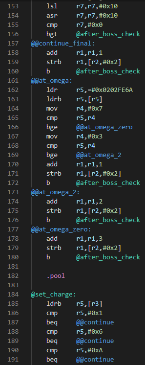

# vscode-armips README

Syntax highlighting for GBA assembly code using the [ARMIPS](https://github.com/Kingcom/armips) assembler.

## Features

Includes syntax highlighting for

- Strings
- Constants
- Variables defined with the `equ` directive
    - Although ARMIPS supports upper/lowercase characters, numbers and underscores in variable names, variable names will not be highlighted if they use lowercase characters (because otherwise every single word would be considered a variable name)
- Directives
- Labels
    - Different highlighting for global, static and local labels
    
Also:

- Folding on blocks of `.area`, `.create`, `.open`, `.if`, `.func`, `.macro`, and `.region`

## Release Notes

### 1.0.1

- Added icon

### 1.0.0

Initial release
